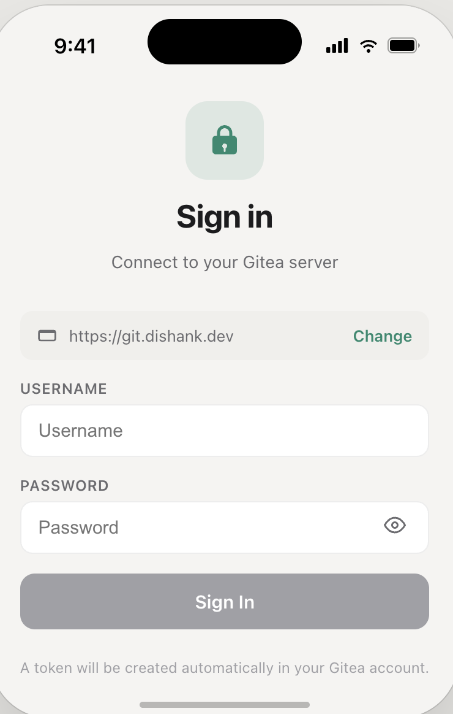
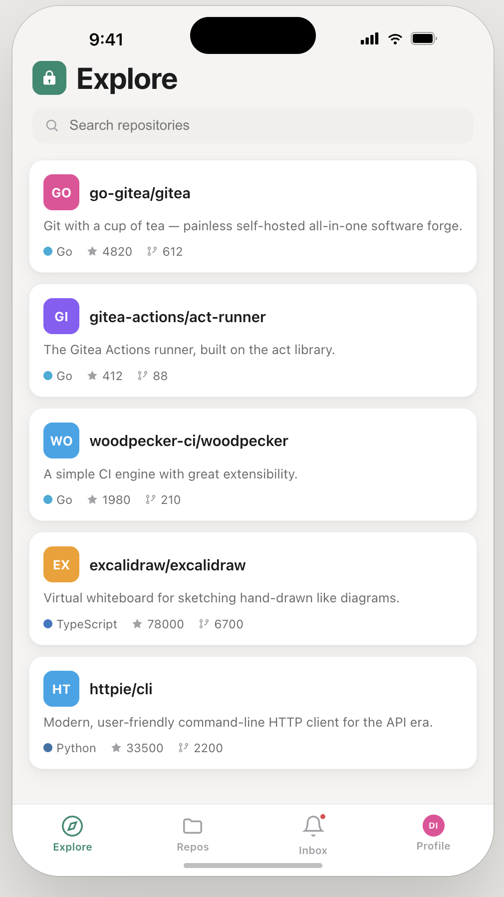
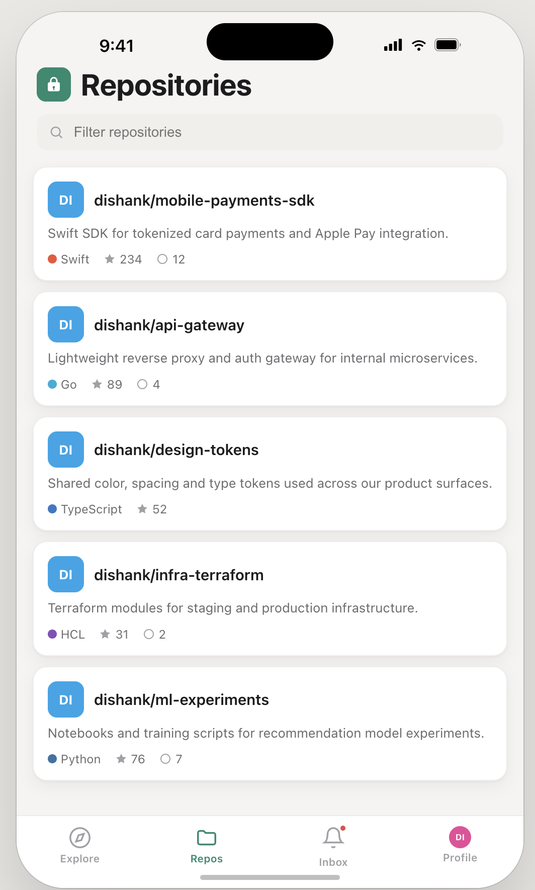
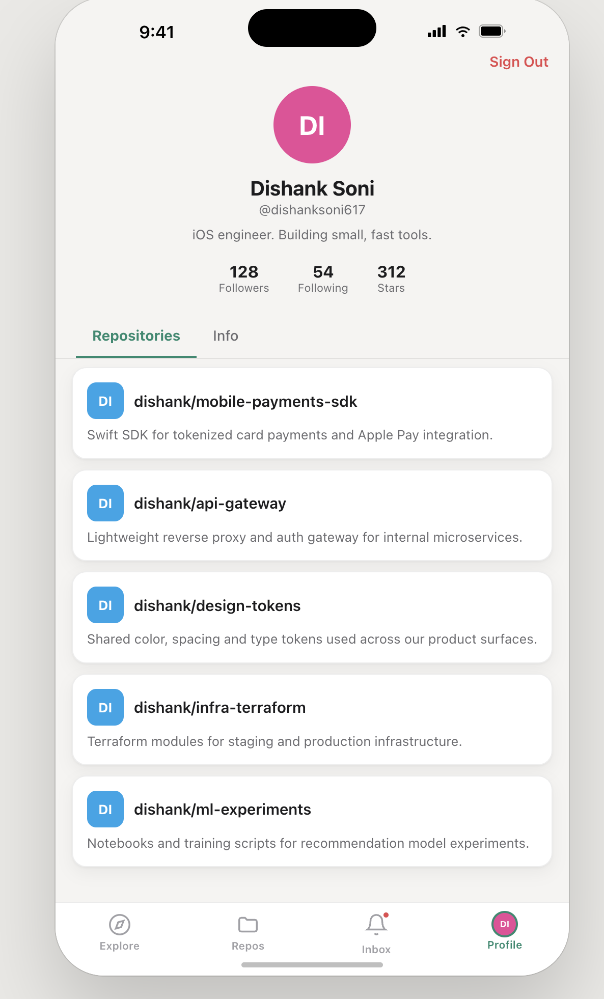

# GiteaClient

A native iOS app for browsing your self-hosted [Gitea](https://gitea.io) server. Browse repositories, issues, pull requests, notifications, and your profile — all from your iPhone.

Built with SwiftUI, targeting iOS 16+. No third-party dependencies.

---

## Screenshots

<p float="left">
  
  
  
  
</p>

---

## Features

- **Repositories** — browse your repos, explore files, view READMEs, releases, and commit history
- **Issues** — list and read issues with label badges and markdown rendering
- **Pull Requests** — view open/closed PRs with diff context
- **Notifications** — inbox with All / Unread filter
- **Profile** — view your account info and sign out
- **Explore** — discover public repositories on your server

---

## Requirements

- iOS 16+
- Xcode 15+
- A running [Gitea](https://gitea.io) instance (self-hosted)

---

## Getting Started

### Build

```bash
# Install xcodegen if you don't have it
brew install xcodegen

cd GiteaClient
xcodegen generate
open GiteaClient.xcodeproj
```

Build and run on any iPhone 16 simulator (or a physical device with your Team ID set in `project.yml`).

### Sign in

1. Enter your Gitea server URL (e.g. `https://gitea.example.com`)
2. Log in with your Gitea username and password
3. The app creates a Gitea API token and stores it securely in Keychain

---

## Project Structure

```
GiteaClient/
├── App/                    – @main entry point, AppState (EnvironmentObject)
├── Models/                 – Codable structs for Gitea API responses
├── Services/
│   ├── GiteaAPIClient.swift  – all HTTP, token auth
│   └── KeychainHelper.swift  – token + server URL persistence
├── ViewModels/             – @MainActor ObservableObjects per feature
└── Views/
    ├── Components/         – DesignSystem, headers, reusable UI
    ├── Auth/               – Login + server URL screens
    ├── Main/               – Tab container (ZStack opacity pattern)
    ├── Repositories/       – Repo list, detail, file explorer, README
    ├── Issues/             – Issue list + detail
    ├── PullRequests/       – PR list + detail
    ├── Notifications/      – Inbox
    ├── Explore/            – Explore view
    └── Profile/            – Profile view
```

### Navigation

No native `TabView` or `NavigationBar`. The app uses a custom `ZStack`-based tab system that preserves each tab's `NavigationStack` state across switches, with a `CustomTabBar` pinned via `.safeAreaInset`.

### Design System

Defined in `DesignSystem.swift` — adaptive light/dark tokens:

| Token | Light | Dark |
|---|---|---|
| `Color.appBg` | `#F5F4F2` | `#17191A` |
| `Color.appCard` | `#FFFFFF` | `#212325` |
| Accent | `#1F8A6F` | `#4FCBA6` |

---

## Configuration

To build for a physical device, set your Apple Developer Team ID in `project.yml`:

```yaml
DEVELOPMENT_TEAM: "YOUR_TEAM_ID"
```

Then re-run `xcodegen generate`.

---

## License

[MIT](LICENSE)
